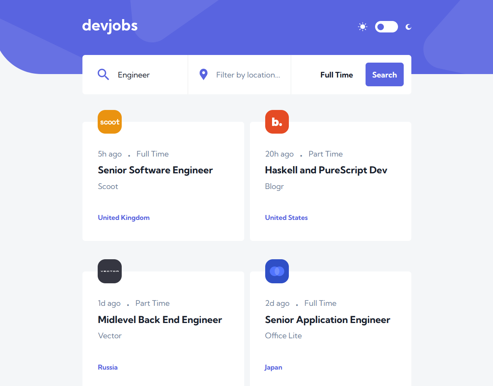

# Devjobs Web App

  

## Table Of Content

- [Description](#description)
- [Deployed website link](#deployedWebsite)
- [Installation](#installation)
- [Usage](#usage)
- [Contributing](#contribution)
- [Tests](#tests)
- [GitHub](#github)
- [Contact](#contact)
- [License](#license)

  

## Description

  Devjobs Web App is a modern job search platform designed to connect developers with their dream jobs. Built with React and powered by Vite for an optimized development experience, this application offers a sleek user interface and a responsive design for job seekers on any device.

Deployed website: <strong><a href="http://blockchaincyberpunk1.github.io/devjobs-web-app-v1">http://blockchaincyberpunk1.github.io/devjobs-web-app-v1</a></strong>

   
Live Demo

## Installation

To set up this project locally, follow these steps:

Clone the repository:

git clone https://github.com/yourusername/devjobs-web-app.git

cd devjobs-web-app

Install the dependencies:

npm install

Start the development server:

npm run dev

Build for production:

npm run build

Preview the production build:

npm run preview

## Built With

Devjobs Web App is built with the following tools and libraries: <ul><li>React: A JavaScript library for building user interfaces, allowing for a modular and interactive web application.</li> <li>React DOM: The package that allows React to communicate with the DOM, making it possible to manipulate the web page in response to user interactions.</li> <li>Vite: A build tool that significantly improves the frontend development experience with features like fast hot module replacement (HMR).</li> <li>@vitejs/plugin-react: This official plugin from Vite enables React fast refresh and other features tailored for React development.</li></ul>

## Usage
 
Navigate through the job listings on the main page, use the search functionality to filter jobs, and click on a job to view more details. The responsive design ensures a seamless experience on both desktop and mobile devices.

## Contribution
 
Contributions are welcome! Please feel free to submit a pull request or create an issue for any bugs or improvements.

## Tests
 
To ensure the application runs correctly:

Run the test command:

npm test

Check for any errors and ensure all tests pass.

## GitHub

<a href="https://github.com/blockchaincyberpunk1"><strong>blockchaincyberpunk1</a></strong>

Visit my website: <strong><a href="http://blockchaincyberpunk1.github.io/thepolyglot">The Polyglot</a></strong>

## Contact

Feel free to reach out to me on my email:
thepolyglot8@gmail.com

## License

